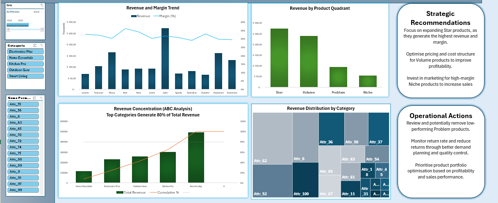

# 📊 Sales Performance Dashboard (Excel)

---

## 🔍 Overview

This project presents an interactive Excel dashboard developed as part of a Master's degree in Business Analytics.

The dashboard provides a comprehensive analysis of sales performance and supports business decision-making through data-driven insights.

⚠️ **Note:** The dataset used in this project is synthetic and created for educational purposes.

---

## 📊 Key Features

- KPI tracking (Revenue, Profit, Margin, Return Rate)
- YoY Growth analysis
- Product Quadrant Analysis (Star, Volume, Niche, Problem)
- ABC (Pareto) Analysis
- Interactive filtering with slicers

---

## 🛠 Tools & Techniques

- Microsoft Excel
- Power Query (data cleaning & transformation)
- Data Model (fact table + dimension tables)
- DAX measures for KPIs and calculations
- Pivot Tables and Pivot Charts
- Interactive dashboard design

---

## 📈 Dashboard Components

### 🔹 KPI Panel
Tracks key business metrics:
- Total Revenue  
- Total Profit  
- Margin (%)  
- Return Rate  
- YoY Growth  

### 🔹 Revenue and Margin Trend
Shows monthly performance of revenue and margin.

### 🔹 Quadrant Analysis
Classifies products into:
- Star  
- Volume  
- Niche  
- Problem  

Helps identify high-performing and underperforming products.

### 🔹 ABC Analysis
Applies Pareto principle to highlight top revenue-generating categories.

### 🔹 Category Distribution
Visual representation of revenue contribution by product category.

---

## 💡 Key Insights

- Revenue is concentrated in Star and Volume products  
- Pareto effect observed across categories  
- Margin optimisation opportunities exist in Volume products  
- Niche products show high profitability potential  
- Problem products contribute minimally to revenue  

---

## 🚀 Recommendations

### Strategic
- Focus on expanding high-performing (Star) products  
- Improve profitability of Volume products  
- Invest in promoting high-margin Niche products  

### Operational
- Review and optimise low-performing products  
- Reduce return rate through better planning and quality control  
- Improve product portfolio management  

---

## 📁 Files

- `sales-performance-dashboard.xlsm` → main dashboard file  
- `dashboard_overview.png` → dashboard overview  
- `dashboard_kpi.png` → KPI section  
